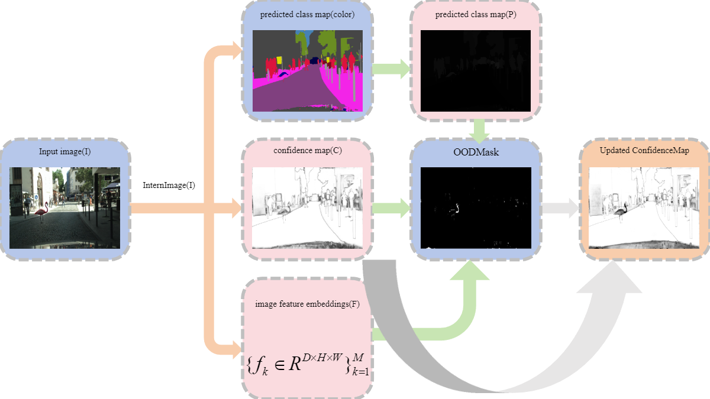

# InternImage-OOD

This repository contains the implementation of the InternImage-OOD framework, which integrates the InternImage model with a KMeans-based Out-of-Distribution (OOD) detection mechanism. The method achieved top performance in the BRAVO Challenge, with a notable Bravo Index of 0.6263.

## Overview

InternImage-OOD is a cutting-edge framework designed to enhance OOD detection by combining powerful image features with clustering techniques. This approach leverages the strengths of InternImage for feature extraction, followed by KMeans clustering to detect and refine OOD regions in the input images.

## Methodology

The core methodology is based on the following steps:
1. **Feature Extraction**: The InternImage model extracts feature embeddings `F` from input images, represented as:

   `F = { f_k ∈ ℝ^{D × H × W} }_{k=1}^{M} = FeatureEmbedding(I)`

   where `I` is the input image, `D` is the feature dimension, and `H × W` is the spatial resolution.

2. **OOD Detection**: KMeans clustering is applied to these feature embeddings to detect OOD regions:
    - P denotes the predicted class map, where each pixel is assigned a label by the InternImage model.
    - C is the confidence map, indicating the model's confidence in each prediction.
    - F represents the feature embeddings used for further refinement.

    After clustering, the OOD mask is generated, and the confidence map is updated to reflect low confidence in detected OOD regions.

## Results

Considering the time constraints of the competition and to demonstrate the effectiveness of our method on smaller datasets, we used only the Mapillary Vistas and Cityscapes datasets for this experiment. Despite the limited data, InternImage-OOD achieved the top spot in the BRAVO Challenge, with a Bravo Index of 0.6263.

Our method achieved the following results in the BRAVO Challenge:
| Method             | Bravo Index | Semantic | OOD    |
|--------------------|-------------|----------|--------|
| InternImage-OOD    | **0.6263**  | 0.6934   | 0.5710 |
| Ablation (no KMeans)| 0.6208     | 0.6933   | 0.5621 |

However, it is worth noting that while the overall performance was strong, there is still room for improvement in OOD detection. Future work will focus on advancing this area.

## Example Usage

1. **Setup**: 
   - Ensure you have the required dependencies installed.
   - Clone this repository and navigate to the project directory.

2. **Feature Extraction**:
   - Run the feature extraction process on your dataset.
   - Save the extracted features in the specified directory structure.

(You can download a case of checkpoint [here](https://huggingface.co/OpenGVLab/InternImage/resolve/main/upernet_internimage_xl_512x1024_160k_cityscapes.pth)!!!)

3. **Training KMeans**:
   - Train the KMeans model on the extracted features.

4. **OOD Detection**:
   - Use the trained KMeans model to perform OOD detection on your test images.
   - Update the confidence map based on the detected OOD regions.

## Acknowledgments

We would like to thank the BRAVO Challenge organizers for providing the platform and resources to evaluate our methods. Special thanks to our team members for their dedication and hard work throughout this project. This work was supported by CASIA and UCAS.

